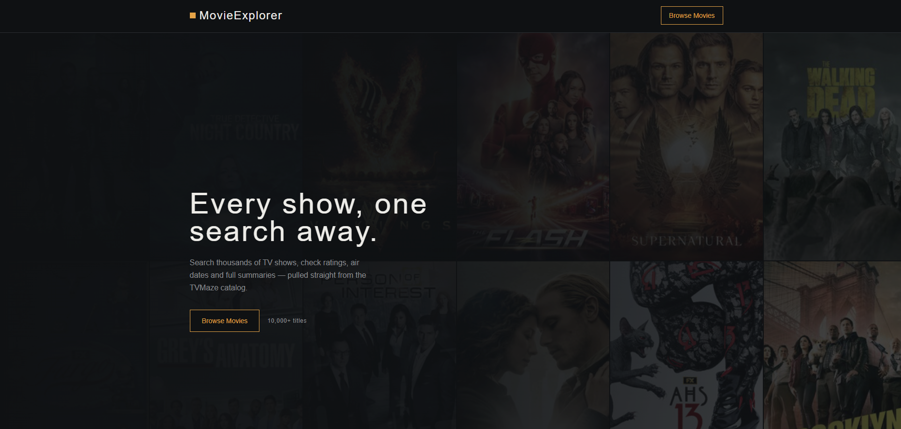

# 🎬 MovieExplorer

A responsive movie/TV show explorer built with React and the [TVMaze API](https://www.tvmaze.com/api). Browse shows, search by title, and view detailed information — cast, rating, release date, genres and overview — in an interactive modal.

**Live demo:** [l2-movie-explorer.vercel.app](https://l2-movie-explorer.vercel.app/)


---

## Overview

MovieExplorer is a single-page React application with two main views:

- **Home** — a landing page with a hero banner and a call-to-action into the catalog.
- **Movies** — a searchable, paginated grid of shows pulled live from TVMaze, with a details modal for each title.

All show data (posters, ratings, summaries, genres) is fetched directly from the public TVMaze API — no backend or API key required.

## Features

- 🔍 Live search by show title, debounced to avoid excessive API calls
- 🎬 Responsive card grid (2 → 5 columns depending on screen size)
- 🪟 Details modal — closable via the close button, backdrop click, or `Esc`
- 📱 Fully responsive, from mobile to desktop
- ⚡ Fast dev/build tooling via Vite

## Tech Stack

| Category         | Technology                                                                 |
| ----------------- | --------------------------------------------------------------------------- |
| Framework         | [React 19](https://react.dev/)                                              |
| Build tool        | [Vite 8](https://vite.dev/)                                                 |
| Routing           | [React Router 8](https://reactrouter.com/)                                  |
| Styling           | [Tailwind CSS 4](https://tailwindcss.com/) (CSS-first config, via `@tailwindcss/vite`) |
| Icons             | [react-icons](https://react-icons.github.io/react-icons/)                   |
| Data source       | [TVMaze API](https://www.tvmaze.com/api)                                    |
| Linting           | ESLint, with `eslint-plugin-react-hooks` and `eslint-plugin-react-refresh`   |

## Project Structure

```
movie-explorer/
├── src/
│   ├── api/
│   │   └── tvmaze.js            # TVMaze API wrapper (getAllShows, searchShows)
│   ├── components/
│   │   ├── home/
│   │   │   └── HeroBanner.jsx
│   │   ├── layout/
│   │   │   ├── Navbar.jsx
│   │   │   └── Footer.jsx
│   │   └── movies/
│   │       ├── SearchBar.jsx
│   │       ├── MovieCard.jsx
│   │       ├── MovieGrid.jsx
│   │       └── MovieModal.jsx
│   ├── hooks/
│   │   ├── useMovies.js         # search/listing state, debounced fetching
│   │   └── useDocumentTitle.js  # sets the browser tab title per page
│   ├── pages/
│   │   ├── Home.jsx
│   │   └── MovieListing.jsx
│   ├── utils/
│   │   └── normalizeShow.js     # flattens raw TVMaze show objects
│   ├── index.css                # Tailwind import + design tokens (@theme)
│   ├── App.jsx                  # route definitions
│   └── main.jsx                 # app entry point
├── package.json
└── vite.config.js
```

## Getting Started

### Prerequisites

- [Node.js](https://nodejs.org/) 18 or newer
- npm (comes with Node.js)

### Installation

```bash
# Clone the repository
git clone https://github.com/tawhidzihad/movie-explorer.git
cd movie-explorer

# Install dependencies
npm install
```

### Running locally

```bash
npm run dev
```

The app will be available at `http://localhost:5173` by default.

### Other scripts

| Command           | Description                                  |
| ------------------ | --------------------------------------------- |
| `npm run dev`       | Start the Vite dev server with hot reload     |
| `npm run build`     | Build a production bundle into `dist/`        |
| `npm run preview`   | Preview the production build locally          |
| `npm run lint`      | Run ESLint across the project                 |

## API Reference

This project consumes the free, public [TVMaze API](https://www.tvmaze.com/api) — no API key or authentication is required.

| Endpoint                     | Used for                     |
| ------------------------------ | ------------------------------ |
| `GET /shows`                   | Default show listing           |
| `GET /search/shows?q={query}`  | Title search                   |

## License

This project was built as a learning assignment and is available for reference and educational use.